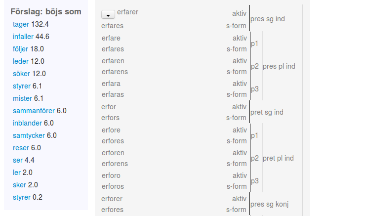
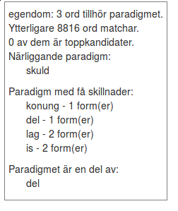

# Spec för nytt böjningsmaskineri till Karp

### Teknisk information

- I varje ordingång sparas information om böjning (vilket mönster ordet böjs enligt, samt variabeltilldelning)
  så att det entydigt går att beräkna den korrekta fullformstabellen.

- En separat resurs innehåller alla tänkbara böjningsmönster

- Vid ändring av ett böjningsmönster påverkas alla ord som "pekar" på detta.
  Vid en sådan ändring behövs därför kontroller, se nedan (B.5).

- Fullformstabellerna genereras vid behov, tex automatiskt en gång om dygnet, eller via
  en knapp i gränssnittet.

- Böjningsmönstret innefattar ordformer och dess taggar (tex msd).

- Alla resurser är tillgängliga som rådata för redaktörer och systemutvecklare,
  men se också framtida gränssnitt "Redigera och utforska böjning" nedan.

### A: Viktiga funktioner

1. Lägg till nytt ord: "x böjs som ordet y". Tabell visas för godkännande/modifiering.
  Resultat: en ny böjningsangivelse i ordets ingång och därmed kan en ny
  fullformstabell genereras. Eventuellt också ett nytt böjningsmönster.

2. Lägg till nytt ord genom att mata in dess böjningsformer (och taggar).
    Om böjningsmönstret redan finns ges information om detta,
    i annat fall skapas och sparas det nya mönstret.
  Resultat: en ny böjningsangivelse i ordets ingång, och eventuellt ett nytt böjningsmönster.
3. Se fördelning av ord över böjningsmönster, dvs simpel statistik:
  hur många ord böjs enligt varje mönster
4. För varje böjningsmönster: vilka ord hör hit?
5. För varje ord: vilka ord böjs lika?
6. Få förslag på hur ord (de som saknar böjningsangivelse) böjs, se bild 1 nedan.
  Förslagen tas fram mha metoden beskriven i [Forsberg, M; Hulden, M. (2016)](http://anthology.aclweb.org/W16-2405)
7. Frekvensinformation för varje ordform, både existerande och föreslagna.
8. Ändra ett paradigm och därmed på de resulterande tabellerna för alla tillhörande ord.

### B: Önskvärt

1. Se liknande paradigm (se bild 2 för enkelt exempel på existerande jämförelse). Se hur två olika paradigm skiljer sig

2. Kunna gruppera paradigmen enligt lingvistiskt intressanta mönster
3. Mha korpusmaterial: vilka okända ord finns som verkar höra till kända böjningsmönster?
  Vi använder metoden beskriven i [Forsberg, M; Hulden, M. (2016)](http://anthology.aclweb.org/W16-2405).

4. Formella kontroller och stöd - få hjälp att hitta fel. Tex, vid uppdatering av paradigm:
vilka ord påverkas, hur påverkar det deras tabeller (visa och varna
vid tex stor negativ effekt på frekvensinformation).

## Vyer
Minst två vyer/miljör behövs, en för ord och en för böjningsmönster.

###  Redigera ord
  Ex: Visa hur ord X böjs, böj det istället som Y. Ändra, experimentera med detta ord,
  eventuellt spara ändringen.

  Funktioner:

  - A.1
  - A.2
  - A.5
  - A.6
  - A.7

###  Redigera och utforska böjning
  Ex: Utforska och eventuellt spara böjningar på böjningsmönsternivå.
      Vad händer om jag ändrar på ett böjningsmönster?

  Funktioner:

 - A.3
 - A.4
 - A.5
 - A.6
 - A.7
 - A.8
 - B.1
 - B.2
 - B.3
 - B.4

## Ännu ej begrundat
- **2/3-ställighet**
  "Hur hanteras skillnaden mellan ’maximalt tänkbara former
~ sökbara former’ och ’former som ska visas i app/webb’?"
  "Observera att det i databasen kommer att finnas både ’aktiva’ ord (som
  ska tas med vid publicering) och ord som man har med för informationens
  skull (”förrådsord” - ord på väg in i/ut ur publikationsmassan + bra att
  ha för böjningen-ord), det betyder att den här typen av funktioner måste
  kompletteras med diverse olika selekterings/filtreringssteg"

- **Ledtext och inherenta drag**
 "Om böjningen på ytan ser lika ut men man vill ha olika taggning, betraktas
det som olika eller samma böjningsmönster (exempel: hen/henom, han/honom, samma
böjningsregel +om, men olika taggning fem/mask)?"

- **Hur gruppera paradigm?**
 "Vi har talat om att lägga in någon form av typ-attribut på
 böjningsklasserna, t.ex. grupp 17: substantiv, 3de deklinationen, utan
 stamförändringar grupp12: substantiv, 2da deklinationen, utan
 stamförändringar. Förkortat på lämpligt sätt förstås, för att möjliggöra
 sortering och utsökning. Informationen finns i Sture Bergs dokumentation men
 behöver kodifieras. Har ni förslag på hur grupperingen skulle göras?"

- **Avstavning / soft hyphen**
  "Vid generering av artiklar för publikation behövs funktion för insättning av
  avstavningsmarkör (soft hyphen) i böjda ordformer"
  "Kan ordledsinformation ingå i variabeltilldelningen (behövs för avstavningssystemet)?"

